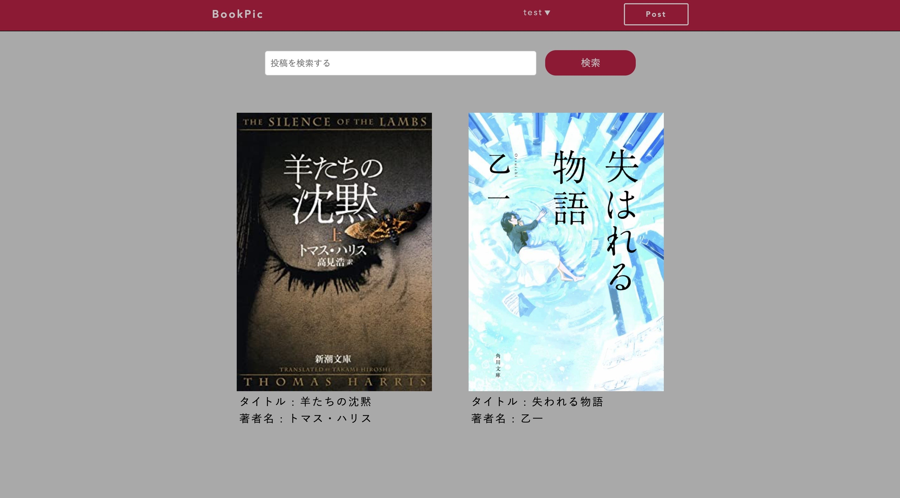

# README

### アプリ名　bookpic 
GIF:https://i.gyazo.com/9eed49f08d6f910a407561f58d740d3b.mp4  

### 概要  
現状は本の投稿を行い、その投稿にストーリーや評価などの投稿を個々のユーザーに行ってもらいます。  
その投稿に対してコメントが可能なので、コミュニケーションを取ることができます。  
今後の実装において、元の構想として投稿アプリと本のデータベースを合わせたアプリを作成したいと考えており、  
1,ユーザーの投稿を蓄積させてデータベース化させる  
2,検索機能と本の情報量の向上  
3,デザインやUIのビルドアップ  
以上の3点を実装を目指して行きます。  

### 本番環境  
接続先情報  
http://18.182.134.200/

テスト用アカウント  
アドレス名:test@jp  
パスワード:test11  
Githubリポジトリ:https://github.com/Resy31/bookpic.git  

### 制作背景  
アプリ作成においてどんな物を作るか悩んでいたのですが、身近な小さな悩みを解決できるアプリをまずは作ってみようと考えました。  
小説、雑誌など本が好きだったので、詳しい人が本についてオススメを教えてもらえるアプリを作れば、生活を少し楽しくできると思い作成しております。

### 工夫したポイント  
SNSが知識や情報を得る大きなツールとなっているので、ただ本を検索できるだけのアプリではなく  
投稿という形でデータベースと作っていくことで、SNSに近い形で情報の交換と検索ができるようになっています。  
今後の実装でSNS版本の検索アプリを作っていきたいと思います。  

### 使用技術  
Ruby/Ruby on Rails/MySQL/Github/AWS/Visual Studio Code
